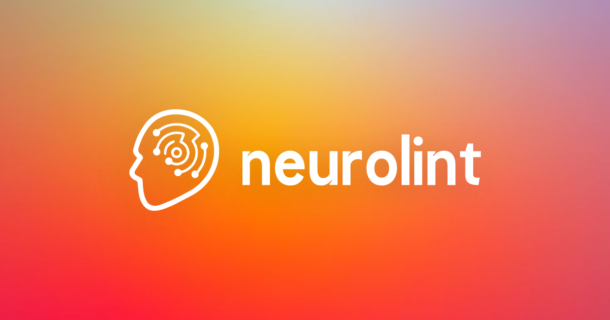

# neurolint - AI Code Review Assistant



Visit us at [neurolint.com](https://neurolint.com)

A modern Next.js app for intelligent code analysis using AI providers like OpenAI, Anthropic, and local models.

## Features

- 🤖 AI-powered code analysis
- 🔒 Security scanning
- ⚡ Performance optimization
- ✨ Code quality improvements
- 🎨 Beautiful UI with shadcn/ui
- 🔐 Authentication with Supabase
- 📱 Responsive design

## Tech Stack

- **Framework**: Next.js 15 (App Router)
- **Database**: Supabase (PostgreSQL)
- **Auth**: Supabase Auth
- **UI**: shadcn/ui + Tailwind CSS v4
- **AI**: OpenAI, Anthropic, Ollama
- **Code Editor**: Monaco Editor

## UI/UX Patterns

### Component Architecture
- **Atomic Design**: Components are organized in a hierarchical structure
  - `ui/`: Base components (Button, Input, Card, etc.)
  - `features/`: Feature-specific components
  - `home/`: Landing page components
  - `layout/`: Layout components

### Design System
- **Dark Mode First**: Built with dark mode as the primary theme, with light mode support
- **Mobile-First**: Responsive design starting from mobile breakpoints
- **Color Palette**:
  - Primary: Deep purple (`#7C3AED`) for main actions and branding
  - Secondary: Slate (`#64748B`) for secondary elements
  - Accent: Emerald (`#10B981`) for success states
  - Destructive: Rose (`#F43F5E`) for errors and warnings
  - Background: Dark slate (`#0F172A`) for dark mode, white for light mode
  - Text: White/off-white for dark mode, dark slate for light mode
- **Consistent Styling**: Using shadcn/ui components with Tailwind CSS
- **Accessibility**: ARIA attributes and keyboard navigation support

### Common Patterns
- **Card-based Layout**: Information organized in cards for better visual hierarchy
- **Form Patterns**: Consistent form layouts with validation and error states
- **Loading States**: Skeleton loaders and loading spinners
- **Error Handling**: Toast notifications and inline error messages
- **Modal Dialogs**: For confirmations and detailed views
- **Dropdown Menus**: For actions and navigation

## Coding Patterns

### API Architecture
- **RESTful Routes**: Organized under `app/api/`
- **Authentication**: Supabase Auth with protected routes
- **Error Handling**: Consistent error responses with status codes
- **Data Validation**: Request validation before processing

### State Management
- **Server Components**: Next.js App Router with React Server Components
- **Client Components**: Marked with "use client" directive
- **Form State**: React Hook Form for form management
- **Data Fetching**: Server-side data fetching with caching

### Code Organization
- **Feature-based Structure**: Code organized by feature/domain
- **Type Safety**: TypeScript for type checking
- **Utility Functions**: Shared utilities in `lib/` directory
- **Constants**: Configuration and constants in separate files

### Best Practices
- **Error Boundaries**: For graceful error handling
- **Loading States**: Suspense boundaries for loading states
- **Code Splitting**: Dynamic imports for better performance
- **Environment Variables**: Type-safe environment configuration

## Getting Started

### Prerequisites

- Node.js 18+ and npm
- Supabase account
- OpenAI API key (optional)
- Anthropic API key (optional)

### Installation

1. Clone the repository:
   ```bash
   git clone https://github.com/yourusername/neurolint.git
   cd neurolint
   ```

2. Install dependencies:
   ```bash
   npm install
   ```

3. Set up environment variables:
   - Copy `.env.local.example` to `.env.local`
   - Fill in your Supabase and AI provider credentials

   Example `.env.local`:
   ```env
   # Supabase Configuration
   NEXT_PUBLIC_SUPABASE_URL=your-project.supabase.co
   NEXT_PUBLIC_SUPABASE_ANON_KEY=your-anon-key
   SUPABASE_SERVICE_ROLE_KEY=your-service-role-key

   # AI Provider Keys (Optional)
   OPENAI_API_KEY=sk-...
   ANTHROPIC_API_KEY=sk-ant-...

   # Application URL
   NEXT_PUBLIC_APP_URL=http://localhost:3000
   ```

4. Set up Supabase:
   - Create a new project at [supabase.com](https://supabase.com)
   - Run the SQL migrations in `supabase/migrations`
   - Enable Email and OAuth providers in Auth settings

5. Start the development server:
   ```bash
   npm run dev
   ```

6. Open [http://localhost:3000](http://localhost:3000) in your browser

## Project Structure

```
src/
├── app/              # Next.js app router pages
├── components/       # React components
├── lib/             # Utility functions and services
└── types/           # TypeScript type definitions
```

## Contributing

1. Fork the repository
2. Create your feature branch (`git checkout -b feature/amazing-feature`)
3. Commit your changes (`git commit -m 'Add some amazing feature'`)
4. Push to the branch (`git push origin feature/amazing-feature`)
5. Open a Pull Request

## License

This project is licensed under the MIT License - see the [LICENSE](LICENSE) file for details.

## Acknowledgments

- [Next.js](https://nextjs.org/)
- [Supabase](https://supabase.com/)
- [shadcn/ui](https://ui.shadcn.com/)
- [Tailwind CSS](https://tailwindcss.com/)
- [OpenAI](https://openai.com/)
- [Anthropic](https://www.anthropic.com/)
- [davidroyal](https://www.davidroyal.dev/)
